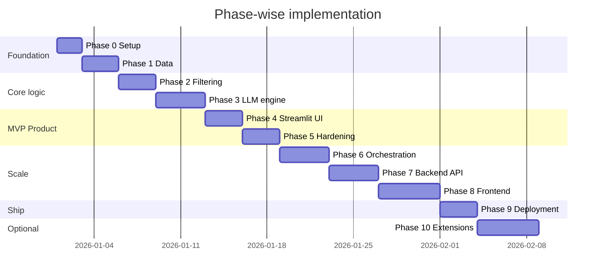
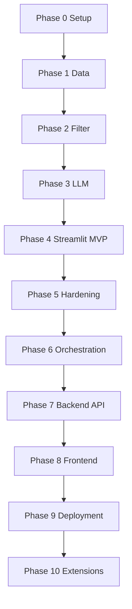

# Implementation Plan: Phase-Wise Delivery

This document defines **when and in what order** to build the AI-powered restaurant recommendation system. Each phase produces a runnable increment with clear exit criteria before moving on.

**Source documents**

| Document | Role |
|----------|------|
| [problemStatement.md](./problemStatement.md) | Scope and success criteria |
| [context.md](./context.md) | Workflow and output fields |
| [architecture.md](./architecture.md) | Layers, components, data flow |
| [edge-cases.md](./edge-cases.md) | Edge cases, expected behavior, tests |

**Rule:** Do not start a phase until the previous phase's exit criteria are met.

---

## Summary timeline



Durations are indicative (days of focused work). Adjust to your schedule.

---

## Phase map: context + architecture

| Phase | Scope | Architecture layer | Primary modules |
|-------|-------|-------------------|-----------------|
| 0 | Setup | Repo + config | Project skeleton |
| 1 | Data ingestion | Layer 1 — Data | `src/data/ingest.py`, `src/models/restaurant.py` |
| 2 | Filtering | Layer 2 — Filtering | `src/models/preferences.py`, `src/filter/engine.py` |
| 3 | LLM engine | Layers 3–4 | `src/llm/*`, `src/recommendation/engine.py` |
| 4 | Streamlit MVP | Layer 5 — Presentation (Streamlit) | `src/app/streamlit_app.py` |
| 5 | Hardening | Cross-cutting | `tests/`, logging, README |
| 6 | Orchestration | Layers 3–4 (pipeline contract) | `src/recommendation/orchestrator.py`, `src/recommendation/cache.py` |
| 7 | **Backend API** | **Layer 6 — REST API (FastAPI)** | **`src/api/`** |
| 8 | **Frontend** | **Layer 7 — Frontend (React/Next.js)** | **`frontend/`** |
| 9 | Deployment | All layers | `Dockerfile`, `docker-compose.yml`, CI |
| 10 | Extensions | Optional | API cache, feedback, vector search |



**Critical path:** 0 → 1 → 2 → 3 → 4 → 5 → 6 → 7 → 8 → 9. Phase 10 is optional.

---

## Phase 0 — Project foundation ✅

**Goal:** Runnable repo, dependencies, and configuration — no business logic yet.

### Tasks
- [x] Python project, `.gitignore`, `src/` package layout, `.env.example`, `README.md`
- [x] Pin core deps: `datasets`, `pandas`, `python-dotenv`, `groq`, `streamlit`, `pytest`

### Exit criteria
- Fresh clone → venv → `pip install -r requirements.txt` → imports succeed
- Secrets never committed; only `.env.example` in git

---

## Phase 1 — Data ingestion and normalization ✅

**Goal:** Load the Zomato dataset, normalize it, cache locally, expose `load_catalog()`.

### Key deliverables
| File | Purpose |
|------|---------|
| `src/models/restaurant.py` | `Restaurant` dataclass |
| `src/data/ingest.py` | Ingest pipeline + `load_catalog()` |

### Exit criteria
- `load_catalog()` returns 40 000+ valid records
- Second run uses parquet cache (no re-download)

---

## Phase 2 — Filtering engine ✅

**Goal:** Deterministic shortlist from user preferences — no LLM involved.

### Key deliverables
| File | Purpose |
|------|---------|
| `src/models/preferences.py` | `UserPreferences` dataclass |
| `src/filter/engine.py` | `filter_restaurants(catalog, prefs) → FilterResult` |

### Exit criteria
- Typical prefs → non-empty shortlist in < 1 s
- Impossible prefs → empty list + hints

---

## Phase 3 — LLM recommendation engine (Groq) ✅

**Goal:** Send shortlist + preferences to Groq; return ranked recommendations with explanations.

### Key deliverables
| File | Purpose |
|------|---------|
| `src/models/recommendation.py` | `Recommendation` dataclass |
| `src/llm/client.py` | `GroqClient` + `LLMClient` protocol |
| `src/llm/prompts.py` | System + user prompt templates |
| `src/recommendation/engine.py` | LLM call, parse, retry, fallback |

### Exit criteria
- End-to-end: prefs → filter → Groq → 3–5 `Recommendation` objects
- Fallback works with `MOCK_LLM=1`

---

## Phase 4 — Streamlit MVP UI ✅

**Goal:** Working user-facing app over Streamlit — proves the pipeline end-to-end before building a proper frontend.

### Key deliverables
| File | Purpose |
|------|---------|
| `src/app/streamlit_app.py` | Streamlit presentation layer |
| `src/app/forms.py` | Form validation helpers |

### Manual test
```bash
streamlit run src/app/streamlit_app.py
MOCK_LLM=1 streamlit run src/app/streamlit_app.py
```

### Exit criteria
- Non-developer can run locally, submit prefs, see ≥ 3 recommendations
- Invalid form input shows inline errors

---

## Phase 5 — Hardening, testing, and documentation ✅

**Goal:** Demo-ready quality: tests green, logging, smoke checklist, Makefile.

### Smoke test checklist
| # | Step | Expected |
|---|------|----------|
| 1 | Install + set `GROQ_API_KEY` | No install errors |
| 2 | First run loads/caches data | Catalog stats in logs |
| 3 | Submit typical prefs | 3–5 recommendations with explanations |
| 4 | Submit impossible prefs | Friendly empty state with hints |
| 5 | `MOCK_LLM=1` | Fallback rankings shown |
| 6 | `pytest` | All tests pass |

### Exit criteria
- `pytest` all green; logging covers catalog size, shortlist, LLM latency, fallback flag
- API keys never logged; limitations documented in README

---

## Phase 6 — Recommendation Orchestration ✅

**Goal:** Single `orchestrator.run(PipelineRequest) → PipelineResponse` contract used by every caller — with request-level LRU cache.

### Key deliverables
| File | Purpose |
|------|---------|
| `src/recommendation/contracts.py` | `PipelineRequest` + `PipelineResponse` |
| `src/recommendation/orchestrator.py` | `RecommendationOrchestrator.run()` |
| `src/recommendation/cache.py` | LRU result cache (TTL, DISABLE_CACHE) |
| `tests/test_orchestrator.py` | 21 tests: happy path, cache hit/miss, fallback |

### Exit criteria
- `orchestrator.run()` never raises; all errors in response
- Cache hit skips the LLM call (verified by mock call count)

---

## Phase 7 — Backend REST API (FastAPI)

**Goal:** Expose the recommendation pipeline as a proper HTTP API so any frontend (React, mobile, CLI) can consume it — decoupling presentation from business logic entirely.

**Why this phase exists:** Streamlit (Phase 4) couples UI and pipeline in one Python process. A REST API separates them: the backend owns data, filtering, LLM, and orchestration; the frontend (Phase 8) is a pure consumer.

**Maps to:** [architecture.md §6 — API Layer](./architecture.md#6-api-layer)

### Architecture after Phase 7

```
React Frontend (Phase 8)
        │  HTTP / JSON
        ▼
FastAPI Backend  ←── src/api/
        │
        ▼
RecommendationOrchestrator  ←── src/recommendation/
        │
        ▼
Groq API
```

### Tasks

#### 7a — FastAPI application skeleton
- [ ] Create `src/api/__init__.py`, `src/api/main.py`
- [ ] Register lifespan: load catalog once on startup, store on `app.state`
- [ ] Add CORS middleware (allow all origins in dev; restrict in prod via `ALLOWED_ORIGINS` env var)
- [ ] Add `uvicorn[standard]` and `fastapi` to `requirements.txt`

#### 7b — Pydantic API models
- [ ] `src/api/models.py`:
  - `RecommendationRequest`: `location`, `budget` (`low|medium|high`), `cuisine`, `min_rating` (0–5), `extras` (list), `max_recommendations` (1–10)
  - `RecommendationItem`: `restaurant_name`, `cuisine`, `rating`, `estimated_cost`, `explanation`
  - `RecommendationResponse`: `request_id`, `recommendations`, `summary`, `filter_code`, `rec_code`, `used_fallback`, `hints`, `latency_ms`, `shortlist_size`
  - `HealthResponse`: `status`, `catalog_size`, `groq_configured`, `mock_mode`
  - `CitiesResponse`: `cities` (list of strings)

#### 7c — Route handlers
- [ ] `src/api/routes/health.py` — `GET /health`
  - Returns catalog loaded ✓, Groq key present ✓/✗, MOCK_LLM mode
- [ ] `src/api/routes/catalog.py` — `GET /cities`, `GET /cuisines`
  - `GET /cities` → top 50 cities ranked by restaurant count
  - `GET /cuisines` → top 50 cuisines ranked by frequency
- [ ] `src/api/routes/recommendations.py` — `POST /recommendations`
  - Validates `RecommendationRequest` (Pydantic handles it)
  - Calls `orchestrator.run(PipelineRequest(...))`
  - Returns `RecommendationResponse`
  - Returns HTTP 422 on validation error; HTTP 200 always on pipeline result (fallback included)

#### 7d — Shared dependencies
- [ ] `src/api/dependencies.py`:
  - `get_catalog()` → returns `app.state.catalog` (loaded at startup)
  - `get_orchestrator()` → returns `RecommendationOrchestrator` with module-level cache singleton

#### 7e — API entry point
- [ ] `src/api/run.py` — `uvicorn src.api.main:app --reload` wrapper
- [ ] Update `Makefile`: `make api` starts the server on port 8000

#### 7f — Tests
- [ ] `tests/test_api.py` using FastAPI `TestClient`:
  - `GET /health` → 200, correct shape
  - `GET /cities` → 200, list of strings
  - `GET /cuisines` → 200, list of strings
  - `POST /recommendations` valid prefs + mock LLM → 200, recommendations present
  - `POST /recommendations` impossible prefs → 200, `filter_code=EMPTY_SHORTLIST`, hints present
  - `POST /recommendations` invalid body (missing location) → 422
  - `POST /recommendations` LLM down → 200, `used_fallback=True`

### Deliverables

| File | Purpose |
|------|---------|
| `src/api/__init__.py` | Package marker |
| `src/api/main.py` | FastAPI app, lifespan, CORS |
| `src/api/models.py` | Pydantic request/response models |
| `src/api/dependencies.py` | Shared catalog + orchestrator deps |
| `src/api/routes/health.py` | `GET /health` |
| `src/api/routes/catalog.py` | `GET /cities`, `GET /cuisines` |
| `src/api/routes/recommendations.py` | `POST /recommendations` |
| `src/api/run.py` | uvicorn entry point |
| `tests/test_api.py` | API layer tests (TestClient, mocked LLM) |

### Exit criteria
- `GET /health` returns 200 with catalog size and Groq status
- `POST /recommendations` returns valid `RecommendationResponse` for any input (never 500)
- `POST /recommendations` with `MOCK_LLM=1` returns fallback rankings
- All API tests pass with `pytest`
- Interactive docs at `http://localhost:8000/docs`

### Manual test
```bash
make api          # starts uvicorn on port 8000
# or:
uvicorn src.api.main:app --reload --port 8000

# Health check
curl http://localhost:8000/health

# Cities
curl http://localhost:8000/cities

# Recommendations
curl -X POST http://localhost:8000/recommendations \
  -H "Content-Type: application/json" \
  -d '{"location":"Bangalore","budget":"medium","cuisine":"North Indian","min_rating":4.0}'
```

---

## Phase 8 — Frontend (React / Next.js)

**Goal:** Replace the Streamlit MVP with a production-quality React frontend that consumes the Phase 7 API — matching the design spec from the Stitch prompt.

**Maps to:** [architecture.md §7 — Frontend Layer](./architecture.md#7-frontend-layer)

### Tasks

#### 8a — Project scaffold
- [ ] `npx create-next-app@latest frontend --typescript --tailwind --app`
- [ ] Install deps: `axios` or `fetch`, `lucide-react`, `framer-motion`, `shadcn/ui`
- [ ] `frontend/.env.local`: `NEXT_PUBLIC_API_URL=http://localhost:8000`

#### 8b — API client
- [ ] `frontend/lib/api.ts`: typed wrappers for `GET /health`, `GET /cities`, `GET /cuisines`, `POST /recommendations`
- [ ] Full TypeScript types matching `RecommendationRequest` / `RecommendationResponse`

#### 8c — Pages and components
- [ ] `app/page.tsx` — Home: hero + preference form
  - Location searchable dropdown (seeded from `GET /cities`)
  - Budget 3-button toggle (low / medium / high)
  - Cuisine text input with autocomplete chips (from `GET /cuisines`)
  - Rating slider (0–5, step 0.5)
  - Extras multi-select pill tags
  - Primary CTA: "Find Restaurants →"
- [ ] `app/results/page.tsx` — Results page
  - AI summary bar (collapsible)
  - Restaurant cards: rank badge, name, cuisine pill, ★ rating, ₹ cost, AI explanation block
  - Filter chips: All / Highest Rated / Lowest Cost
  - "Adjust preferences" back button
- [ ] `components/LoadingState.tsx` — 3-step animated progress
- [ ] `components/EmptyState.tsx` — illustration + suggestion chips
- [ ] `components/FallbackBanner.tsx` — amber warning when `used_fallback=true`
- [ ] `components/HealthIndicator.tsx` — catalog / Groq status (from `GET /health`)

#### 8d — Styling
- [ ] Colour tokens in `tailwind.config.ts`: charcoal bg, coral/orange accent, AI purple-blue gradient
- [ ] Card component: rounded-2xl, soft shadow, slight glassmorphism on summary bar
- [ ] Staggered card entrance animation (framer-motion)

#### 8e — Tests
- [ ] `frontend/__tests__/api.test.ts` — mock fetch, test request/response shaping
- [ ] `frontend/__tests__/components.test.tsx` — render smoke tests (React Testing Library)

### Deliverables

| Path | Purpose |
|------|---------|
| `frontend/` | Next.js app root |
| `frontend/app/page.tsx` | Home / preference form |
| `frontend/app/results/page.tsx` | Results page |
| `frontend/lib/api.ts` | Typed API client |
| `frontend/components/` | Shared UI components |

### Exit criteria
- `npm run dev` in `frontend/` → app loads at `http://localhost:3000`
- Submitting prefs calls `POST /recommendations` and renders result cards
- Empty state and fallback state render correctly
- `npm test` passes

---

## Phase 9 — Deployment (Frontend + Backend)

**Goal:** Package frontend and backend as separate services; deploy both with a single `docker compose up`.

**Maps to:** [architecture.md §8 — Deployment](./architecture.md#8-deployment)

### Tasks

#### 9a — Docker multi-service setup
- [ ] Update `Dockerfile` → split into `Dockerfile.api` (FastAPI/uvicorn) and `Dockerfile.frontend` (Next.js)
- [ ] Update `docker-compose.yml`:
  - `api` service: port 8000, mounts `data/` volume, reads `.env`
  - `frontend` service: port 3000, `NEXT_PUBLIC_API_URL=http://api:8000`
  - `ingest` service: one-shot catalog build (profile: tools)
- [ ] Nginx or Caddy reverse proxy (optional): `/api/*` → api:8000, `/*` → frontend:3000

#### 9b — CI updates
- [ ] Update `.github/workflows/ci.yml`:
  - Python job: `pytest` (existing)
  - Node job: `npm ci && npm test` in `frontend/`

#### 9c — Cloud deployment
- [ ] Backend: Railway / Render / VPS (FastAPI)
- [ ] Frontend: Vercel (Next.js) with `NEXT_PUBLIC_API_URL` pointing to deployed backend

#### 9d — Update runbook
- [ ] Update `docs/deployment.md` for two-service architecture

### Exit criteria
- `docker compose up` starts both services; full flow works end-to-end
- CI runs Python + Node tests on every push
- Both services deployed to public URLs

---

## Phase 10 — Extensions (optional)

**Goal:** Evolve the product without rewriting core layers.

Pick one or more mini-phases; each must not break Phase 9 smoke tests.

| Extension | Tasks | Depends on |
|-----------|--------|------------|
| **Recommendation cache (Redis)** | Replace in-memory LRU with Redis; TTL config | Phase 6 |
| **User feedback** | Thumbs up/down in frontend; store via `POST /feedback` | Phase 7, 8 |
| **Location autocomplete** | Fuzzy city search in frontend using `/cities` | Phase 7, 8 |
| **Observability** | Structured JSON logs, Prometheus metrics endpoint | Phase 7 |
| **Alternate LLM** | Swap `LLMClient` impl (OpenAI, Anthropic) | Phase 3 |
| **Vector search** | Semantic cuisine/ambiance matching before filter cap | Phase 1, 2 |
| **Auth** | API key or OAuth for multi-tenant deploys | Phase 7, 9 |

---

## Suggested repo structure (end state)

```
testrepo/
├── README.md
├── requirements.txt
├── .env.example
├── .gitignore
├── Makefile
├── Dockerfile.api                      # Phase 9
├── Dockerfile.frontend                 # Phase 9
├── docker-compose.yml                  # Phase 9
├── .dockerignore
├── .github/
│   └── workflows/
│       └── ci.yml
├── data/                               # gitignored catalog cache
├── docs/
│   ├── problemStatement.md
│   ├── context.md
│   ├── architecture.md
│   ├── implementation-plan.md
│   ├── edge-cases.md
│   └── deployment.md
├── src/
│   ├── models/
│   │   ├── restaurant.py               # Phase 1
│   │   ├── preferences.py              # Phase 2
│   │   └── recommendation.py           # Phase 3
│   ├── data/
│   │   └── ingest.py                   # Phase 1
│   ├── filter/
│   │   └── engine.py                   # Phase 2
│   ├── llm/
│   │   ├── client.py                   # Phase 3
│   │   └── prompts.py                  # Phase 3
│   ├── recommendation/
│   │   ├── engine.py                   # Phase 3
│   │   ├── run.py                      # Phase 3 CLI
│   │   ├── contracts.py                # Phase 6
│   │   ├── orchestrator.py             # Phase 6
│   │   └── cache.py                    # Phase 6
│   ├── app/
│   │   ├── streamlit_app.py            # Phase 4 (Streamlit MVP)
│   │   └── forms.py                    # Phase 4
│   └── api/                            # Phase 7
│       ├── __init__.py
│       ├── main.py
│       ├── models.py
│       ├── dependencies.py
│       ├── run.py
│       └── routes/
│           ├── health.py
│           ├── catalog.py
│           └── recommendations.py
├── frontend/                           # Phase 8
│   ├── app/
│   │   ├── page.tsx
│   │   └── results/page.tsx
│   ├── components/
│   ├── lib/api.ts
│   └── package.json
└── tests/
    ├── conftest.py
    ├── test_ingest.py
    ├── test_filter.py
    ├── test_recommendation.py
    ├── test_app_forms.py
    ├── test_pipeline.py
    ├── test_orchestrator.py
    └── test_api.py                     # Phase 7
```

---

## Definition of done (whole project)

- [x] User can enter location, budget, cuisine, min rating, extras *(Phase 4)*
- [x] System uses Hugging Face Zomato dataset *(Phase 1)*
- [x] Groq LLM ranks restaurants with explanations + fallback *(Phase 3)*
- [x] All tests green; logging complete *(Phase 5)*
- [x] Pipeline orchestration with LRU cache *(Phase 6)*
- [ ] REST API (FastAPI) exposes pipeline over HTTP *(Phase 7)*
- [ ] React/Next.js frontend consumes API *(Phase 8)*
- [ ] Docker + CI deploys frontend + backend together *(Phase 9)*

---

## Latency targets

| Step | Target |
|------|--------|
| `GET /cities` (cached) | < 50 ms |
| `POST /recommendations` filter step | < 1 s |
| `POST /recommendations` Groq call | 1–10 s |
| Frontend render after API response | < 100 ms |

---

## Document map

```
problemStatement.md  →  why
context.md           →  what (workflow)
architecture.md      →  how (structure)
implementation-plan.md → when (phases) — this file
edge-cases.md        →  what can go wrong
deployment.md        →  how to ship it
```
