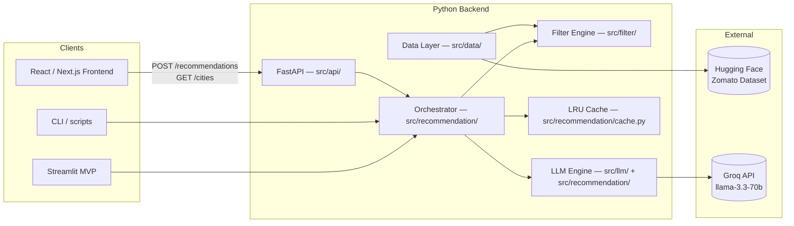
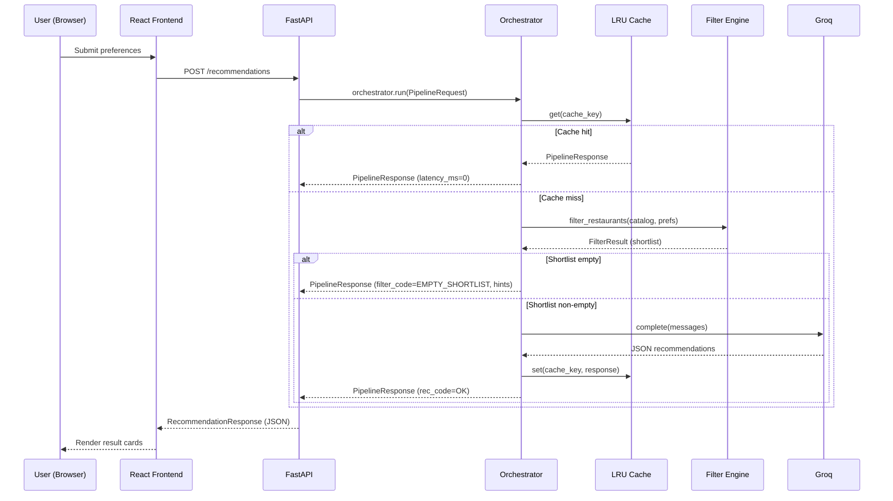

# Architecture: AI-Powered Restaurant Recommendation System

This document describes **how** the system is structured across its full stack: backend pipeline layers, REST API, React frontend, and deployment. It reflects the current state of the project (Phases 0–6 complete) and the target state through Phase 9.

**Related docs:** [context.md](./context.md) · [implementation-plan.md](./implementation-plan.md) · [edge-cases.md](./edge-cases.md) · [deployment.md](./deployment.md)

---

## 1. Architectural goals

| Goal | Rationale |
|------|-----------|
| **Separation of concerns** | Backend pipeline, REST API, and frontend are independent layers — each replaceable without touching the others |
| **Structured-first, LLM-second** | The LLM ranks only a pre-filtered shortlist, reducing hallucination risk and token cost |
| **Single pipeline contract** | All callers (Streamlit, API, CLI) use `orchestrator.run(PipelineRequest) → PipelineResponse` |
| **Graceful degradation** | LLM failure returns rule-based rankings; API never returns 500 on pipeline errors |
| **Frontend/backend decoupled** | React frontend consumes FastAPI via HTTP/JSON — independent deploy, independent scaling |

---

## 2. Full-stack system context



---

## 3. Layered architecture

The system is organised into **7 layers**. Layers only depend downward — higher layers never import from lower layers' internals.

```
Layer 7 — Frontend (React/Next.js)       frontend/
Layer 6 — REST API (FastAPI)             src/api/
Layer 5 — Presentation / Streamlit MVP   src/app/
Layer 4 — Orchestration + Cache          src/recommendation/orchestrator.py, cache.py
Layer 3 — LLM Integration               src/llm/, src/recommendation/engine.py
Layer 2 — Filtering                      src/filter/
Layer 1 — Data                           src/data/, src/models/
```

| Layer | Module | Responsibility |
|-------|--------|----------------|
| **1 — Data** | `src/data/ingest.py` | Download HF dataset, normalize, write parquet cache, expose `load_catalog()` |
| **2 — Filtering** | `src/filter/engine.py` | Apply location / budget / cuisine / rating / extras rules; return `FilterResult` with hints |
| **3 — LLM Integration** | `src/llm/client.py`, `src/llm/prompts.py`, `src/recommendation/engine.py` | Build prompt, call Groq, parse JSON, retry, fallback |
| **4 — Orchestration** | `src/recommendation/orchestrator.py`, `cache.py`, `contracts.py` | Owns the full pipeline; exposes `PipelineRequest → PipelineResponse`; LRU cache |
| **5 — Streamlit MVP** | `src/app/streamlit_app.py` | Phase 4 monolithic UI — useful for demos; superseded by Layers 6+7 |
| **6 — REST API** | `src/api/main.py`, `routes/` | FastAPI; exposes pipeline over HTTP; Pydantic validation; CORS |
| **7 — Frontend** | `frontend/` | React/Next.js; consumes Layer 6 API; full design spec UI |

---

## 4. End-to-end request flow (Phase 7+ full stack)



---

## 5. Data contracts

### 5.1 `Restaurant` (internal catalog record)
```json
{
  "id": "r_abc123",
  "name": "Spice Hub",
  "location": "Bangalore",
  "cuisines": ["North Indian", "Mughlai"],
  "rating": 4.6,
  "cost_for_two": 550.0,
  "metadata": { "area": "Koramangala", "rest_type": "Casual Dining" }
}
```

### 5.2 `UserPreferences` (pipeline input)
```json
{
  "location": "Bangalore",
  "budget": "medium",
  "cuisine": "North Indian",
  "min_rating": 4.0,
  "extras": ["family-friendly"]
}
```

### 5.3 `Recommendation` (LLM output per item)
```json
{
  "restaurant_name": "Spice Hub",
  "cuisine": "North Indian",
  "rating": 4.6,
  "estimated_cost": 550,
  "explanation": "Ranked #1 for North Indian in Bangalore at medium budget — high rating and great value."
}
```

### 5.4 `PipelineRequest` / `PipelineResponse` (orchestration contract)
```json
// Request
{ "preferences": { ... }, "max_recommendations": 5, "request_id": "uuid" }

// Response
{
  "request_id": "uuid",
  "recommendations": [ ... ],
  "summary": "Top North Indian picks in Bangalore.",
  "filter_code": "OK",
  "rec_code": "OK",
  "used_fallback": false,
  "hints": [],
  "latency_ms": 2800,
  "shortlist_size": 50
}
```

### 5.5 `RecommendationRequest` / `RecommendationResponse` (HTTP API contract)
```json
// POST /recommendations — request body
{
  "location": "Bangalore",
  "budget": "medium",
  "cuisine": "North Indian",
  "min_rating": 4.0,
  "extras": [],
  "max_recommendations": 5
}

// 200 response
{
  "request_id": "uuid",
  "recommendations": [
    {
      "restaurant_name": "Spice Hub",
      "cuisine": "North Indian",
      "rating": 4.6,
      "estimated_cost": 550,
      "explanation": "..."
    }
  ],
  "summary": "Top picks for you.",
  "filter_code": "OK",
  "rec_code": "OK",
  "used_fallback": false,
  "hints": [],
  "latency_ms": 2800,
  "shortlist_size": 50
}
```

---

## 6. API Layer (Phase 7)

### Endpoints

| Method | Path | Description |
|--------|------|-------------|
| `GET` | `/health` | System status: catalog loaded, Groq key present, mock mode |
| `GET` | `/cities` | Top 50 cities by restaurant count |
| `GET` | `/cuisines` | Top 50 cuisines by frequency |
| `POST` | `/recommendations` | Main recommendation endpoint |
| `GET` | `/docs` | Interactive Swagger UI (auto-generated) |

### Error handling

| Scenario | HTTP status | Body |
|----------|-------------|------|
| Invalid request (missing field, bad type) | 422 | FastAPI validation error detail |
| Empty shortlist (impossible prefs) | 200 | `filter_code=EMPTY_SHORTLIST`, `hints` populated |
| LLM failure | 200 | `used_fallback=true`, fallback recommendations present |
| Catalog not loaded | 503 | `{ "detail": "Catalog unavailable" }` |

### CORS
Configured via `ALLOWED_ORIGINS` env var (default: `*` for dev). Restrict to the frontend URL in production.

---

## 7. Frontend Layer (Phase 8)

### Technology
- **Framework:** Next.js 14 (App Router)
- **Styling:** Tailwind CSS + shadcn/ui
- **Animation:** Framer Motion
- **API client:** `fetch` with typed wrappers in `frontend/lib/api.ts`

### Pages

| Route | Component | Description |
|-------|-----------|-------------|
| `/` | `app/page.tsx` | Hero + preference form (location, budget, cuisine, rating, extras) |
| `/results` | `app/results/page.tsx` | Result cards, summary bar, filter chips |

### Key components

| Component | Purpose |
|-----------|---------|
| `PreferenceForm` | Controlled form; calls `POST /recommendations` on submit |
| `RestaurantCard` | Rank badge, name, cuisine pill, ★ rating, ₹ cost, AI explanation |
| `LoadingState` | 3-step animated progress (filter → Groq → render) |
| `EmptyState` | Illustration + suggestion chips from `hints` array |
| `FallbackBanner` | Amber warning when `used_fallback=true` |
| `HealthIndicator` | Sidebar: catalog ✅/❌ · Groq ✅/⚠️/❌ |

### Design tokens
| Token | Value | Usage |
|-------|-------|-------|
| Background | `#1A1A2E` | Page background |
| Primary accent | `#FF4C29` | CTA button, active states |
| AI gradient | `#7C3AED → #2563EB` | AI explanation blocks, loading state |
| Card background | `#FFFFFF` | Restaurant cards |

---

## 8. Deployment (Phase 9)

### Single-machine Docker Compose (dev / demo)

```
Browser
  │
  ├── :3000 → frontend service (Next.js)
  │                │
  └── :8000 → api service (FastAPI/uvicorn)
                   │
              data/ volume (parquet cache)
```

### Cloud (production)

```
Vercel (frontend)              Railway / Render (backend)
     │                                  │
     └── NEXT_PUBLIC_API_URL ──────────►│
                                   Groq API
```

### CI (GitHub Actions)
- **Python job:** `pytest` (mocked, no Groq key)
- **Node job:** `npm ci && npm test` in `frontend/`

---

## 9. Physical module layout (current → target)

```
src/
├── models/          # Phase 1–3: data contracts
├── data/            # Phase 1: ingest + cache
├── filter/          # Phase 2: deterministic filter
├── llm/             # Phase 3: Groq client + prompts
├── recommendation/  # Phase 3–6: engine, orchestrator, cache, contracts
├── app/             # Phase 4–5: Streamlit MVP (remains as fallback UI)
└── api/             # Phase 7: FastAPI REST API  ← NEW

frontend/            # Phase 8: React/Next.js frontend  ← NEW
```

**Dependency rule:** API layer imports from `recommendation/` only. Frontend imports from no Python code — consumes HTTP only.

---

## 10. Cross-cutting concerns

### Security
| Concern | Mitigation |
|---------|------------|
| API keys | `GROQ_API_KEY` in env only; never logged; never in image |
| CORS | Restrict `ALLOWED_ORIGINS` to frontend URL in production |
| Prompt injection | User extras length-capped; system prompt restricts scope to shortlist |
| Input validation | Pydantic enforces types/ranges on all API inputs |

### Reliability
| Concern | Mitigation |
|---------|------------|
| LLM timeout | 30 s timeout on Groq client; retry once; fallback |
| Malformed JSON | Retry + fallback in `recommendation/engine.py` |
| Empty catalog | 503 from API health check; startup log warning |
| Stale cache | `CACHE_TTL_SECONDS` (default 300 s); `DISABLE_CACHE=1` bypass |

### Observability
- Structured pipeline log per step: `{"step": "filter", "shortlist": 12, "latency_ms": 4}`
- `GET /health` returns live system status
- LLM latency logged on every Groq call

---

## 11. Technology choices

| Concern | Choice | Alternatives |
|---------|--------|--------------|
| Language | Python 3.11+ | — |
| Pipeline API | FastAPI + uvicorn | Flask, Django |
| Frontend | Next.js 14 + Tailwind | Remix, SvelteKit |
| LLM | Groq (`llama-3.3-70b-versatile`) | OpenAI, Anthropic |
| Cache | In-memory LRU (Phase 6), Redis (Phase 10) | Memcached |
| Dataset access | `datasets` + `pandas` + parquet | Direct CSV |
| MVP UI | Streamlit | Gradio |
| Tests | `pytest` (backend), Jest / RTL (frontend) | unittest |
| Container | Docker + Compose | Podman |
| CI | GitHub Actions | GitLab CI |

---

## 12. Known limitations

- **Dataset coverage** — Primarily Bangalore; other cities have sparse data
- **Budget bands** — `low ≤ ₹400`, `medium ₹401–800`, `high > ₹800` are heuristic
- **LLM grounding** — Prompt constraints reduce but don't eliminate hallucinations; cross-check validates restaurant names against shortlist
- **In-memory cache** — Resets on server restart; replace with Redis for persistence (Phase 10)
- **Single-user MVP** — No auth; add at API layer for multi-tenant (Phase 10)

---

## 13. Document map

```
problemStatement.md  →  why (goals)
context.md           →  what (workflow + output fields)
architecture.md      →  how (structure) — this file
implementation-plan.md → when (phases)
edge-cases.md        →  what can go wrong
deployment.md        →  how to ship it
```
