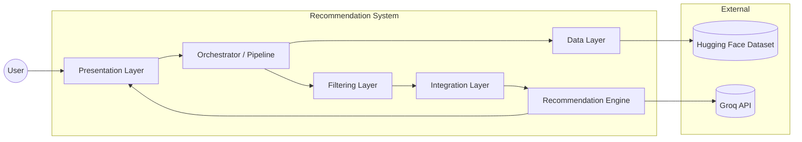
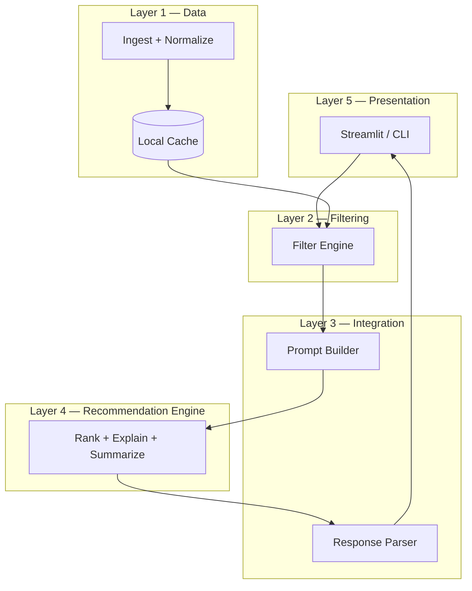
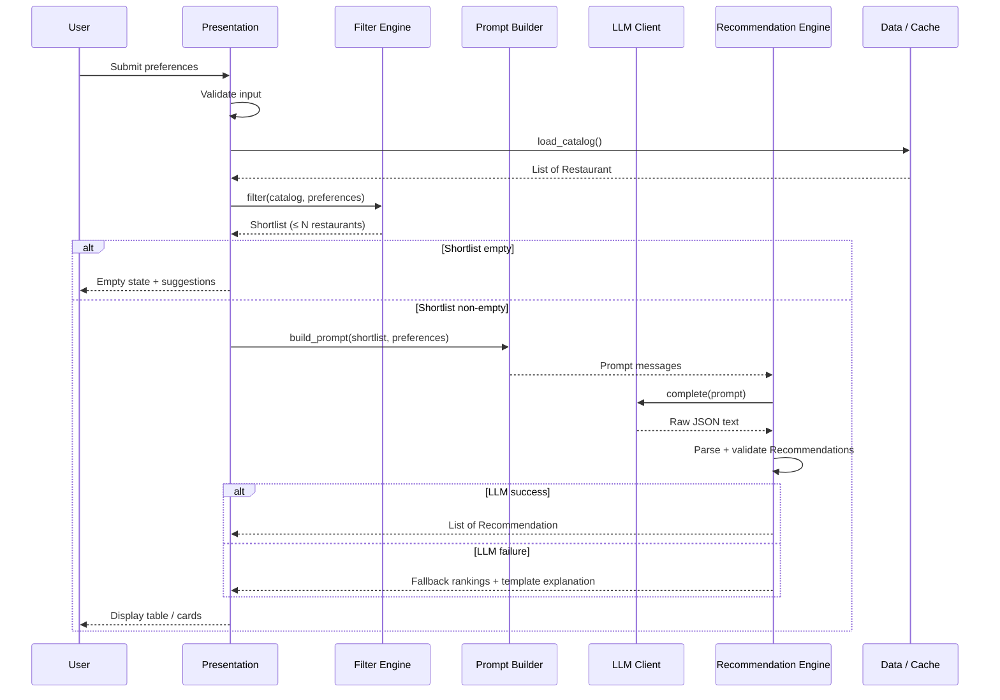
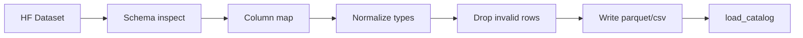
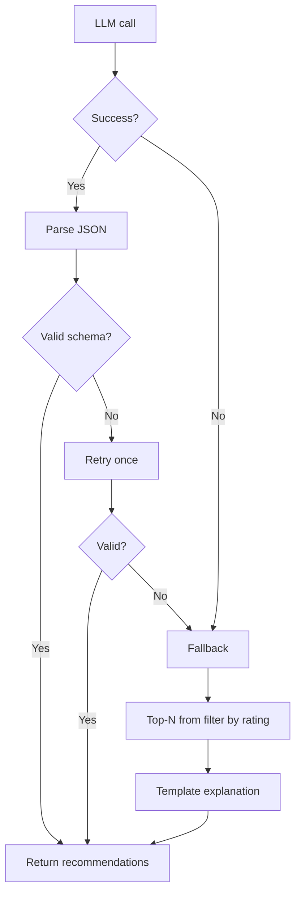
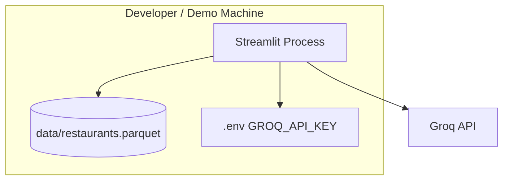
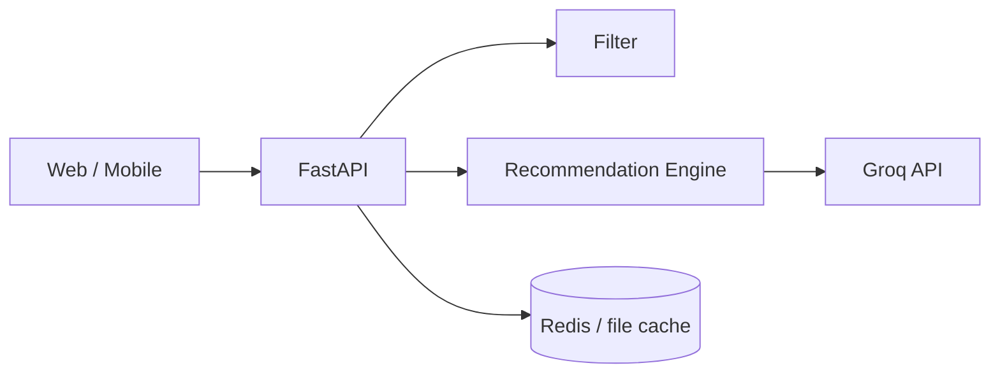
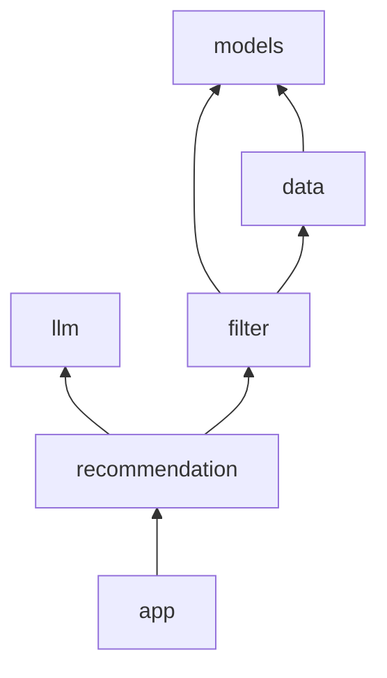

# Architecture: AI-Powered Restaurant Recommendation System

This document describes **how** the system is structured: layers, components, data contracts, and runtime flow. It is derived from [context.md](./context.md) and aligned with [problemStatement.md](../problemStatement.md) and [implementation-plan.md](./implementation-plan.md).

---

## 1. Architectural goals

| Goal | Rationale |
|------|-----------|
| **Separation of concerns** | Data loading, filtering, LLM reasoning, and UI are independent modules so each can be tested and replaced. |
| **Structured-first, LLM-second** | The LLM ranks and explains only from a pre-filtered shortlist—reducing hallucination risk and token cost. |
| **Deterministic filtering** | Location, budget, cuisine, and rating rules run without an LLM for predictable, fast narrowing. |
| **Graceful degradation** | If the LLM fails, return rule-based rankings with a clear fallback message. |
| **MVP-friendly deployment** | Single-process app (e.g. Streamlit) with optional path to REST API later. |

---

## 2. High-level system context



**Actors**

- **User** — Submits preferences and reads recommendations.
- **Hugging Face** — Source of truth for restaurant catalog ([ManikaSaini/zomato-restaurant-recommendation](https://huggingface.co/datasets/ManikaSaini/zomato-restaurant-recommendation)).
- **Groq** — LLM provider (Phase 3–4). Ranks shortlist, writes explanations, optional summary via chat completions API.

---

## 3. Layered architecture

The system follows five logical layers mapped directly to [context.md](./context.md) workflow sections.



| Layer | Maps to context.md | Responsibility |
|-------|-------------------|----------------|
| **Data** | [Data Ingestion](./context.md#data-ingestion) | Load dataset, normalize schema, cache catalog |
| **Filtering** | [User Input](./context.md#user-input) (constraints) | Apply hard filters; produce shortlist |
| **Integration** | [Integration Layer](./context.md#integration-layer) | Serialize shortlist + prefs into LLM prompt; parse JSON response |
| **Recommendation** | [Recommendation Engine](./context.md#recommendation-engine) | Invoke LLM; validate output; fallback ranking |
| **Presentation** | [Output Display](./context.md#output-display) | Forms, validation, formatted results |

---

## 4. End-to-end request flow



**Typical latency budget (MVP)**

| Step | Target |
|------|--------|
| Load catalog (cached) | &lt; 500 ms |
| Filter shortlist | &lt; 1 s |
| Groq LLM call | 1–10 s (model-dependent) |
| Render UI | &lt; 100 ms |

---

## 5. Component design

### 5.1 Data layer

**Purpose:** Ingest and preprocess the Zomato dataset; expose a stable in-memory (or cached) catalog.

| Component | File (suggested) | Description |
|-----------|------------------|-------------|
| `Restaurant` model | `src/models/restaurant.py` | Canonical record after normalization |
| `ingest` | `src/data/ingest.py` | Download via `datasets`, clean, write cache |
| `load_catalog` | `src/data/ingest.py` | Read cache or re-ingest; return `list[Restaurant]` |

**Ingestion pipeline**



**Extracted fields (minimum)**

| Field | Type | Notes |
|-------|------|-------|
| `id` | string | Stable identifier (generated if missing) |
| `name` | string | Restaurant name |
| `location` | string | City / area |
| `cuisines` | list[str] or string | Tokenized for matching |
| `rating` | float | Aggregate rating |
| `cost_for_two` | float | Used for budget bands |
| `metadata` | dict (optional) | Extra columns for future filters |

**Caching:** Processed catalog stored under `data/` (gitignored). Second run skips HF download when cache is fresh.

---

### 5.2 Filtering layer

**Purpose:** Apply deterministic rules from [User Input](./context.md#user-input) before any LLM call.

| Component | File (suggested) | Description |
|-----------|------------------|-------------|
| `UserPreferences` | `src/models/preferences.py` | Input contract from UI/CLI |
| `FilterEngine` | `src/filter/engine.py` | `filter(catalog, prefs) -> list[Restaurant]` |

**Preference model**

```python
# Conceptual contract (not implementation)
UserPreferences:
    location: str           # e.g. "Delhi", "Bangalore"
    budget: Literal["low", "medium", "high"]
    cuisine: str            # e.g. "Italian", "Chinese"
    min_rating: float       # e.g. 4.0
    extras: list[str]       # e.g. ["family-friendly", "quick service"]
```

**Filter rules**

| Preference | Rule |
|------------|------|
| Location | Case-insensitive match on `location` (substring or exact, configurable) |
| Min rating | `restaurant.rating >= min_rating` |
| Cuisine | Token or substring match on `cuisines` |
| Budget | Map `low` / `medium` / `high` to `cost_for_two` ranges (defined after dataset EDA) |
| Extras | Keyword boost/filter on name or metadata when available |

**Shortlist cap:** Sort by rating descending; return top **20–50** rows to limit prompt size.

**Empty shortlist:** Return structured error with hints (lower `min_rating`, broaden cuisine, change location).

---

### 5.3 Integration layer

**Purpose:** Bridge structured data and the LLM per [Integration Layer](./context.md#integration-layer).

| Component | File (suggested) | Description |
|-----------|------------------|-------------|
| `PromptBuilder` | `src/llm/prompts.py` | System + user messages |
| `LLMClient` | `src/llm/client.py` | Provider abstraction (`complete(messages) -> str`) |
| `GroqClient` | `src/llm/client.py` | Default implementation using [Groq](https://console.groq.com/) chat completions |
| `ResponseParser` | `src/recommendation/engine.py` | JSON parse + schema validation |

**Prompt design principles**

1. **Grounding** — Instruct the model to choose **only** restaurants present in the provided shortlist (by name/id).
2. **Structured output** — Require JSON array matching `Recommendation` schema.
3. **Reasoning** — Ask for a short explanation per pick tied to user preferences.
4. **Ranking** — Explicit order: best match first; cap at top 5 (configurable).
5. **Optional summary** — One-line overview of the set when useful for UI.

**Prompt structure (conceptual)**

```
System:
  You are a restaurant advisor. Use only restaurants from the list.
  Output valid JSON: array of { restaurant_name, cuisine, rating, estimated_cost, explanation }.

User:
  Preferences: { location, budget, cuisine, min_rating, extras }
  Shortlist: [ { name, location, cuisines, rating, cost_for_two }, ... ]
  Return top 5 ranked recommendations.
```

**Token control:** Truncate long cuisine strings; omit non-essential columns from shortlist serialization.

**Groq configuration (default provider)**

| Variable | Purpose | Example |
|----------|---------|---------|
| `GROQ_API_KEY` | API key from [Groq Console](https://console.groq.com/keys) | `gsk_...` |
| `GROQ_MODEL` | Chat model id | `llama-3.3-70b-versatile` |
| `MOCK_LLM` | Skip Groq; use rule-based fallback | `1` |

`GroqClient` uses the official `groq` Python SDK with `response_format` JSON when supported. The Streamlit app (Phase 4) calls the same `RecommendationEngine` path—no separate OpenAI dependency in the MVP.

---

### 5.4 Recommendation engine

**Purpose:** Orchestrate LLM call and produce final [Output Display](./context.md#output-display) objects.

| Component | File (suggested) | Description |
|-----------|------------------|-------------|
| `Recommendation` | `src/models/recommendation.py` | Output contract |
| `RecommendationEngine` | `src/recommendation/engine.py` | `recommend(shortlist, prefs) -> list[Recommendation]` |

**Output model**

| Field | Source |
|-------|--------|
| `restaurant_name` | LLM (must match shortlist) |
| `cuisine` | LLM or joined from catalog |
| `rating` | LLM or catalog |
| `estimated_cost` | LLM or catalog (`cost_for_two`) |
| `explanation` | LLM-generated |
| `summary` (optional) | LLM one-liner for entire result set |

**Fallback path**



---

### 5.5 Presentation layer

**Purpose:** Collect [User Input](./context.md#user-input) and render [Output Display](./context.md#output-display).

| Component | File (suggested) | Description |
|-----------|------------------|-------------|
| Streamlit app | `src/app/streamlit_app.py` | MVP web UI |
| CLI (optional) | `src/cli/main.py` | Scriptable demo |

**UI responsibilities**

- Form: location, budget (select), cuisine, min rating, extras
- Client-side validation (required fields, rating range)
- Loading indicator during LLM call
- Result cards/table with all five output fields
- Empty and error states without stack traces

---

## 6. Data contracts

### 6.1 Restaurant (internal)

```json
{
  "id": "r_12345",
  "name": "Example Bistro",
  "location": "Bangalore",
  "cuisines": ["Italian", "Continental"],
  "rating": 4.2,
  "cost_for_two": 800.0,
  "metadata": {}
}
```

### 6.2 UserPreferences (input)

```json
{
  "location": "Delhi",
  "budget": "medium",
  "cuisine": "North Indian",
  "min_rating": 4.0,
  "extras": ["family-friendly"]
}
```

### 6.3 Recommendation (output)

```json
{
  "restaurant_name": "Example Bistro",
  "cuisine": "Italian",
  "rating": 4.2,
  "estimated_cost": 800,
  "explanation": "Strong match for medium budget and 4+ rating in Delhi."
}
```

---

## 7. Deployment views

### 7.1 MVP (single process)



- One Python process
- Secrets in `.env` (never committed)
- No separate database in MVP

### 7.2 Target (optional extension)



See [Extension points](#extension-points).

---

## 8. Cross-cutting concerns

### 8.1 Security

| Concern | Mitigation |
|---------|------------|
| API keys | `GROQ_API_KEY` in environment only; `.env` gitignored |
| Prompt injection | Treat user `extras` as untrusted; sanitize length; system prompt restricts scope |
| Data leakage | Do not log full prompts with PII in production |

### 8.2 Reliability

| Concern | Mitigation |
|---------|------------|
| LLM timeout / rate limit | Configurable timeout; retry once; fallback to filter ranking |
| Malformed JSON | Schema validation; retry; fallback |
| Empty catalog | Fail fast at startup with clear error |

### 8.3 Observability (MVP)

- Log: catalog size, shortlist size, LLM latency, fallback usage
- Do not log: API keys, full API responses in debug without redaction

### 8.4 Testing strategy

| Layer | Test type |
|-------|-------------|
| Filter | Unit tests with fixture restaurants |
| Integration / LLM | Mock client returning fixed JSON |
| End-to-end | Optional live test behind `RUN_LLM_INTEGRATION=1` |
| UI | Manual smoke checklist (see implementation plan) |

---

## 9. Physical module layout

Aligned with [implementation-plan.md — Suggested repo structure](./implementation-plan.md#suggested-repo-structure):

```
src/
├── models/
│   ├── restaurant.py       # Data layer contract
│   ├── preferences.py      # User input contract
│   └── recommendation.py   # Output contract
├── data/
│   └── ingest.py           # HF load, normalize, cache
├── filter/
│   └── engine.py           # Deterministic shortlist
├── llm/
│   ├── client.py           # GroqClient + LLMClient interface
│   └── prompts.py          # Prompt templates
├── recommendation/
│   └── engine.py           # LLM orchestration + fallback
└── app/
    └── streamlit_app.py    # Presentation
```

**Dependency rule:** Higher layers depend on lower layers only (app → recommendation → filter → data). `llm` is used by `recommendation`, not by `filter`.



---

## 10. Mapping: context.md → architecture

| context.md section | Architecture artifact |
|--------------------|------------------------|
| Data Ingestion | Data layer, `ingest.py`, local cache |
| User Input | `UserPreferences`, UI form, filter rules |
| Integration Layer | `PromptBuilder`, `LLMClient`, shortlist serialization |
| Recommendation Engine | `RecommendationEngine`, fallback, optional summary |
| Output Display | `Recommendation` model, Streamlit table/cards |

---

## 11. Extension points

Designed for incremental evolution without rewriting core layers ([implementation-plan Phase 6](./implementation-plan.md#phase-6--extensions-optional)).

| Extension | Touch layers | Notes |
|-----------|--------------|-------|
| **REST API** | Presentation → new `api/` package | FastAPI wraps existing pipeline; same contracts |
| **Recommendation cache** | Integration + Recommendation | Key = hash(preferences + shortlist ids); TTL configurable |
| **Feedback loop** | Presentation + new `feedback/` store | Thumbs up/down; prompt tuning notes only in MVP |
| **Multi-city / i18n** | Data + Presentation | Autocomplete locations from catalog |
| **Observability** | All | Structured logs, metrics export |
| **Alternative LLM** | `llm/client.py` only | Groq is default; add another `LLMClient` (e.g. OpenAI) if needed |
| **Vector search** | Filter + Data | Optional semantic cuisine/ambiance matching before LLM |

---

## 12. Technology choices (MVP defaults)

| Concern | Choice | Alternatives |
|---------|--------|--------------|
| Language | Python 3.11+ | — |
| Dataset access | `datasets` + `pandas` | Direct CSV download |
| UI | Streamlit | CLI, Gradio |
| LLM | **Groq** via `groq` SDK | OpenAI, Anthropic (swap `LLMClient` only) |
| Cache format | Parquet or CSV | SQLite for larger scale |
| Tests | `pytest` | unittest |

---

## 13. Known limitations

- **Dataset coverage** — Recommendations limited to cities and restaurants present in the Hugging Face dataset.
- **Budget mapping** — `low` / `medium` / `high` thresholds are heuristic until calibrated on data distribution.
- **LLM grounding** — Prompt constraints reduce but do not eliminate wrong picks; validation should cross-check names against shortlist.
- **Cost** — Each Groq request may incur API usage; Groq free tier limits apply; caching and shortlist caps mitigate volume.
- **No auth in MVP** — Single-user local demo; add auth at API layer for multi-tenant deployments.

---

## 14. Document map

```
problemStatement.md     →  why (goals)
context.md              →  what (workflow)
architecture.md         →  how (structure) — this file
implementation-plan.md  →  when (phases)
edge-cases.md           →  failure modes & handling
```

After implementation begins, update the **Physical module layout** section if actual paths diverge from the suggestion above.
