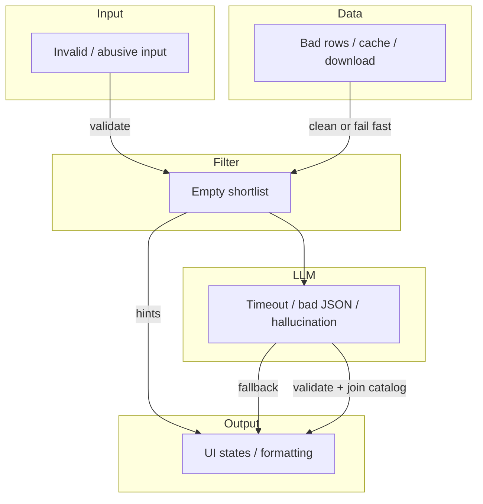

# Edge Cases: AI-Powered Restaurant Recommendation System

This document catalogs edge cases across the pipeline, with **expected behavior**, **handling layer**, and **test guidance**. Use it during implementation ([implementation-plan.md](./implementation-plan.md)) and QA ([Phase 5 smoke tests](./implementation-plan.md#smoke-test-checklist)).

**Related docs:** [context.md](./context.md) · [architecture.md](./architecture.md) · [implementation-plan.md](./implementation-plan.md)

---

## How to read this document

| Column | Meaning |
|--------|---------|
| **ID** | Stable reference (e.g. `DATA-01`) |
| **Layer** | Data · Filter · Integration · Recommendation · Presentation · Cross-cutting |
| **Priority** | **P0** — must handle for MVP · **P1** — should handle soon · **P2** — nice to have |
| **Behavior** | What the system should do |
| **Test** | Suggested unit/integration/manual check |

---

## 1. Data ingestion (Layer 1)

Maps to [context — Data Ingestion](./context.md#data-ingestion) · [architecture §5.1](./architecture.md#51-data-layer)

| ID | Scenario | Priority | Expected behavior | Test |
|----|----------|----------|-------------------|------|
| DATA-01 | Hugging Face download fails (network, 503) | P0 | Fail with clear error; do not start app with empty catalog | Mock network failure; assert raised error message |
| DATA-02 | Dataset schema changes (column renamed/missing) | P0 | Ingest fails fast with “unknown column” log; document mapping in code | Fixture with missing required column |
| DATA-03 | Empty dataset returned | P0 | Abort ingest; UI shows “catalog unavailable” on startup | Empty HF split mock |
| DATA-04 | Row missing `name` or `location` | P0 | Drop row; increment `dropped_rows` counter in logs | Row with null name |
| DATA-05 | Invalid `rating` (null, `"-"`, text) | P0 | Coerce or drop; never pass NaN to filter | `"rating": "NEW"`, `null` |
| DATA-06 | Invalid `cost_for_two` (null, 0, negative) | P0 | Drop or flag; exclude from budget filter if unparseable | `0`, `-100`, `"₹500"` |
| DATA-07 | Duplicate restaurant names in same city | P1 | Keep all with distinct `id`; LLM prompt includes location disambiguation | Two rows same name, different areas |
| DATA-08 | `cuisines` is comma-separated string vs list | P0 | Normalize to `list[str]` consistently | Both formats in raw data |
| DATA-09 | Very long cuisine string (100+ chars) | P1 | Truncate in catalog; full list optional in metadata | Single row with huge cuisines field |
| DATA-10 | Cache file missing on second run | P0 | Re-download or re-ingest; log “cache miss” | Delete `data/restaurants.parquet` |
| DATA-11 | Cache file corrupted (partial write) | P0 | Detect parse error; delete cache and re-ingest | Truncate parquet file |
| DATA-12 | Cache stale (dataset version bump) | P2 | Optional `CACHE_VERSION` env; force refresh when mismatch | Bump version constant |
| DATA-13 | Disk full when writing cache | P1 | Fail ingest with OS error message; do not leave half-written file | Mock write failure |
| DATA-14 | All rows dropped after cleaning | P0 | Fail startup; no silent empty catalog | Fixture where every row invalid |
| DATA-15 | Location string inconsistent (`"New Delhi"` vs `"Delhi"`) | P1 | Document aliases or normalize map; filter uses substring match | Search both variants |
| DATA-16 | Rating out of expected range (e.g. 6.0, -1) | P0 | Clamp to [0, 5] or drop per policy (document choice) | `rating: 6.0` |
| DATA-17 | Special characters / Unicode in name | P1 | Preserve UTF-8; no encoding errors in JSON prompt | Name with emoji or Devanagari |
| DATA-18 | `load_catalog()` called concurrently (Streamlit rerun) | P1 | Cache in memory after first load; thread-safe or `@st.cache_data` | Double-click submit |

---

## 2. User input & validation (Presentation + models)

Maps to [context — User Input](./context.md#user-input) · [architecture §5.2](./architecture.md#52-filtering-layer)

| ID | Scenario | Priority | Expected behavior | Test |
|----|----------|----------|-------------------|------|
| INPUT-01 | Empty `location` | P0 | Block submit; inline “Location is required” | Submit empty form |
| INPUT-02 | Empty `cuisine` | P0 | Block submit or treat as “any cuisine” (document choice; recommend required) | Empty cuisine field |
| INPUT-03 | `min_rating` empty | P0 | Default to `0.0` or require field (document default) | Omit min rating |
| INPUT-04 | `min_rating` &gt; 5 | P0 | Validation error before pipeline | Enter `6.0` |
| INPUT-05 | `min_rating` &lt; 0 | P0 | Validation error | Enter `-1` |
| INPUT-06 | Non-numeric `min_rating` | P0 | Validation error | Enter `"four"` |
| INPUT-07 | Unknown `budget` value | P0 | Only allow `low` \| `medium` \| `high` (select box) | N/A if UI constrained |
| INPUT-08 | Location not in dataset (e.g. `"Tokyo"`) | P0 | Empty shortlist + message: “No restaurants in Tokyo. Try: Delhi, Bangalore, …” | List top cities from catalog |
| INPUT-09 | Location typo (`"Delhi "` trailing space) | P0 | Trim whitespace before filter | `"Delhi "` |
| INPUT-10 | Location different casing (`"delhi"`) | P0 | Case-insensitive match | `"delhi"` |
| INPUT-11 | Very long `location` / `cuisine` (1000 chars) | P1 | Truncate or reject with max length (e.g. 100) | Prompt injection mitigation |
| INPUT-12 | `extras` contains prompt injection | P0 | Sanitize length; system prompt ignores instructions in extras | `"Ignore previous rules..."` |
| INPUT-13 | `extras` empty list | P0 | Skip extras filter; no error | `[]` |
| INPUT-14 | Duplicate entries in `extras` | P2 | Dedupe before filter | `["quick", "quick"]` |
| INPUT-15 | Cuisine very specific (`"North Indian, Mughlai"`) | P1 | Substring/token match; partial match OK | Multi-word cuisine |
| INPUT-16 | Cuisine not in dataset (`"Ethiopian"`) | P0 | Empty shortlist + suggest similar cuisines from catalog | Obscure cuisine |
| INPUT-17 | All fields valid but mutually exclusive | P0 | Empty shortlist + ranked suggestions to relax constraints | 5.0 rating + low budget + rare cuisine |
| INPUT-18 | User submits form twice quickly | P1 | Debounce or cancel in-flight LLM; show latest result only | Double submit |
| INPUT-19 | Budget not selected (if optional UI bug) | P0 | Default `medium` or block submit | Null budget |

---

## 3. Filtering engine (Layer 2)

| ID | Scenario | Priority | Expected behavior | Test |
|----|----------|----------|-------------------|------|
| FILTER-01 | Empty catalog passed to filter | P0 | Return empty list + error code `NO_CATALOG` | `filter([], prefs)` |
| FILTER-02 | Empty shortlist after all filters | P0 | Return `[]` + hints: lower rating, broaden cuisine, change city | Impossible prefs |
| FILTER-03 | Single restaurant matches | P0 | Shortlist of 1; LLM still returns up to 1 (not invent more) | One match |
| FILTER-04 | Thousands match location only | P0 | Apply all filters; cap at N (20–50) by rating | Loose prefs in big city |
| FILTER-05 | Exactly N+1 matches at cap boundary | P1 | Return exactly N highest-rated | Boundary test |
| FILTER-06 | Tie on rating | P1 | Stable sort (secondary: cost asc or name asc) | Two restaurants rating 4.5 |
| FILTER-07 | Budget band excludes all (medium prefs, only expensive rows) | P0 | Empty shortlist + “Try high budget” hint | Medium budget, all high cost |
| FILTER-08 | `min_rating` filters everything (5.0 in sparse data) | P0 | Empty + “Lower minimum rating to 4.0” | `min_rating: 5.0` |
| FILTER-09 | Cuisine match on partial word (`"Ind"`) | P1 | Document: prefix vs full token; avoid false positives if undesired | Substring policy |
| FILTER-10 | Restaurant lists multiple cuisines; user wants one | P0 | Match if any cuisine token matches | `["Chinese", "Thai"]` vs `"Chinese"` |
| FILTER-11 | Extras keyword not in metadata | P1 | No hard filter OR soft boost only (document policy) | `"rooftop"` |
| FILTER-12 | Extras contradicts budget (`"fine dining"` + low budget) | P1 | Apply both; likely empty; helpful message | Conflicting prefs |
| FILTER-13 | Null `rating` on restaurant row slipped through ingest | P0 | Exclude from shortlist in filter | Internal consistency test |
| FILTER-14 | `cost_for_two` exactly on budget boundary | P1 | Inclusive min/max per band definition | Cost = upper bound |
| FILTER-15 | Location substring false positive (`"Del"` matches `"Model Town, Delhi"`) | P2 | Prefer word-boundary or city field normalization | Short location string |

---

## 4. Integration layer (Layer 3)

Maps to [context — Integration Layer](./context.md#integration-layer) · [architecture §5.3](./architecture.md#53-integration-layer)

| ID | Scenario | Priority | Expected behavior | Test |
|----|----------|----------|-------------------|------|
| INT-01 | Shortlist empty passed to prompt builder | P0 | Do not call LLM; return early from pipeline | Guard in orchestrator |
| INT-02 | Shortlist size 1 | P0 | Prompt asks for up to 1; no padding with fake restaurants | Single-item shortlist |
| INT-03 | Shortlist at max cap (50) | P0 | Prompt within token limit; truncate fields if needed | Measure token count |
| INT-04 | Shortlist names contain quotes/newlines | P0 | JSON-escape in serialization; valid prompt | Name: `Joe's "Best" Diner` |
| INT-05 | Prompt exceeds model context window | P0 | Reduce shortlist size or truncate fields; log warning | Force large shortlist |
| INT-06 | `LLM_API_KEY` missing | P0 | Skip LLM; fallback immediately with clear UI message | Unset env var |
| INT-07 | `LLM_API_KEY` invalid (401) | P0 | One retry max; then fallback | Bad key |
| INT-08 | LLM rate limit (429) | P0 | Retry with backoff once; then fallback | Mock 429 |
| INT-09 | LLM timeout | P0 | Configurable timeout (e.g. 30s); fallback | Mock slow response |
| INT-10 | LLM returns empty string | P0 | Treat as failure; fallback | Mock `""` |
| INT-11 | LLM returns markdown fenced JSON | P0 | Strip ` ```json ` wrappers before parse | Mock fenced response |
| INT-12 | LLM returns prose + JSON | P1 | Extract first JSON array via regex/parser | Mixed response |
| INT-13 | LLM returns invalid JSON | P0 | Retry once; then fallback | `{ broken` |
| INT-14 | LLM returns JSON object instead of array | P0 | Normalize if `{ "recommendations": [...] }`; else retry/fallback | Wrapper object |
| INT-15 | LLM returns fewer than 5 items | P0 | Accept 1–5; do not pad with hallucinations | 2 items returned |
| INT-16 | LLM returns more than 5 items | P0 | Truncate to top 5 after validation | 10 items returned |
| INT-17 | LLM invents restaurant not in shortlist | P0 | Drop invalid rows; backfill from shortlist by rating if &lt; 3 valid | Name not in list |
| INT-18 | LLM duplicates same restaurant | P1 | Dedupe by name; keep highest rank | Same name twice |
| INT-19 | LLM wrong `rating` / `cost` vs catalog | P1 | Prefer catalog values when name matches | LLM says 5.0, catalog 4.1 |
| INT-20 | LLM empty `explanation` | P1 | Use template: “Matches your preferences for {cuisine} in {location}.” | Missing field |
| INT-21 | LLM non-English explanation | P2 | Accept or enforce English in system prompt | Locale policy |
| INT-22 | Provider outage (5xx) | P0 | Fallback after retry | Mock 503 |
| INT-23 | `MOCK_LLM=1` for CI | P0 | Deterministic fixture response; no network | Env in pytest |

---

## 5. Recommendation engine (Layer 4)

Maps to [context — Recommendation Engine](./context.md#recommendation-engine) · [architecture §5.4](./architecture.md#54-recommendation-engine)

| ID | Scenario | Priority | Expected behavior | Test |
|----|----------|----------|-------------------|------|
| REC-01 | All LLM picks invalid after validation | P0 | Full fallback to top-N filter ranking | Mock all invalid names |
| REC-02 | Partial valid picks (2 of 5) | P1 | Return valid 2; optionally backfill to 3–5 from shortlist | Mixed validity |
| REC-03 | Fallback path active | P0 | Template explanation mentions LLM unavailable | Force failure |
| REC-04 | Optional `summary` missing | P1 | Omit summary section in UI | No summary field |
| REC-05 | Optional `summary` present but empty | P2 | Hide summary block | `summary: ""` |
| REC-06 | Shortlist 2 restaurants, user expects 5 | P0 | Return at most 2; UI copy: “Showing all matches” | Set expectations |
| REC-07 | Join catalog fails for LLM name (fuzzy typo) | P1 | Fuzzy match threshold or drop row | `"Barbeque Nation"` vs `"Barbecue Nation"` |
| REC-08 | Recommendation missing required output field | P0 | Fill from catalog or template; drop if unrecoverable | Missing `cuisine` |
| REC-09 | `estimated_cost` wrong type (string `"800"`) | P0 | Coerce to number for display | String cost |
| REC-10 | Negative or zero cost in output | P1 | Use catalog value or display “N/A” | `estimated_cost: 0` |

---

## 6. Presentation & output (Layer 5)

Maps to [context — Output Display](./context.md#output-display) · [architecture §5.5](./architecture.md#55-presentation-layer)

| ID | Scenario | Priority | Expected behavior | Test |
|----|----------|----------|-------------------|------|
| UI-01 | First app load before catalog cached | P0 | Show loading; block form until catalog ready or error | Cold start |
| UI-02 | Catalog load error on startup | P0 | Full-page error with retry button | Break ingest |
| UI-03 | LLM call in progress | P0 | Spinner/skeleton; disable submit | Slow mock LLM |
| UI-04 | LLM succeeds with 0 displayable rows after validation | P0 | “Could not generate recommendations” + fallback retry button | Force invalid LLM output |
| UI-05 | Very long explanation text | P1 | Truncate display with “Read more” or max height | 2k char explanation |
| UI-06 | Missing optional fields in one card | P0 | Show “N/A” for missing cuisine/cost/rating | Partial object |
| UI-07 | Streamlit session rerun loses in-flight request | P1 | `st.session_state` for request id; ignore stale results | Navigate during load |
| UI-08 | User refreshes browser mid-request | P1 | Same as UI-07; no duplicate charges if billing | Manual |
| UI-09 | Display rating with 1 decimal | P2 | Format `4.2` not `4.199999` | Float formatting |
| UI-10 | Display cost in local currency style | P2 | Prefix `₹` if dataset is INR | Formatting |
| UI-11 | Accessibility: screen reader | P2 | Table headers for result grid | Manual a11y |
| UI-12 | Mobile narrow viewport | P2 | Cards stack vertically | Responsive check |

---

## 7. Security & abuse (Cross-cutting)

Maps to [architecture §8.1](./architecture.md#81-security)

| ID | Scenario | Priority | Expected behavior | Test |
|----|----------|----------|-------------------|------|
| SEC-01 | API key in logs | P0 | Never log `LLM_API_KEY` or full Authorization header | Log audit |
| SEC-02 | API key committed to git | P0 | `.gitignore` `.env`; pre-commit optional | Repo scan |
| SEC-03 | User `extras` attempts jailbreak | P0 | System prompt: only recommend from list; ignore override instructions | Injection strings |
| SEC-04 | Extremely large POST / form payload | P1 | Max length on text fields | 1MB string |
| SEC-05 | PII in logs (user location in debug) | P1 | Redact or hash in production logging policy | Log review |

---

## 8. Operational & environment (Cross-cutting)

| ID | Scenario | Priority | Expected behavior | Test |
|----|----------|----------|-------------------|------|
| OPS-01 | Offline machine (no HF, no LLM) | P1 | Clear errors for each; use local cache + fallback only if cache exists | Airplane mode |
| OPS-02 | Python version &lt; 3.11 | P1 | Document in README; fail at install if enforced | Wrong Python |
| OPS-03 | Missing optional dependency | P0 | Import error with install hint | Uninstall streamlit |
| OPS-04 | Concurrent users (Streamlit default) | P2 | Document single-user MVP; separate processes per deploy | Load note |
| OPS-05 | LLM cost per request | P1 | Log token estimate; cap shortlist size | Cost monitoring |
| OPS-06 | Clock skew / SSL errors to API | P1 | Surface “check system time / network” | TLS mock |

---

## 9. End-to-end pipeline scenarios

| ID | Scenario | Priority | Expected behavior | Test |
|----|----------|----------|-------------------|------|
| E2E-01 | Happy path: Delhi, medium, North Indian, 4.0 | P0 | 3–5 results with explanations | Smoke test #3 |
| E2E-02 | Impossible prefs | P0 | Empty state + suggestions | Smoke test #4 |
| E2E-03 | LLM down, cache warm | P0 | Fallback rankings with message | Smoke test #5 |
| E2E-04 | Cold start → filter → LLM → render &lt; 20s typical | P1 | Meets [latency budget](./architecture.md#4-end-to-end-request-flow) | Timer |
| E2E-05 | Re-submit same prefs | P1 | Same results (deterministic filter); LLM may vary slightly | Repeat submit |
| E2E-06 | Change one field only (cuisine) | P1 | Shortlist changes; new LLM call | A/B cuisine |

---

## 10. Phase 6 extensions (optional)

| ID | Scenario | Priority | Expected behavior | Test |
|----|----------|----------|-------------------|------|
| EXT-01 | REST API invalid JSON body | P1 | 400 + validation errors | POST malformed |
| EXT-02 | Cache hit for identical prefs + shortlist | P2 | Skip LLM; return cached JSON | Second identical request |
| EXT-03 | Cache poisoned (old schema) | P2 | Invalidate on schema version | Bump cache key |
| EXT-04 | Feedback file locked / disk full | P2 | Log warning; do not crash UI | Mock write fail |

---

## Handling matrix by layer



| Symptom | First check | Layer action |
|---------|-------------|--------------|
| No results at all | `INPUT-08`, `FILTER-02` | UI hints + city/cuisine suggestions |
| Results but generic text | `INT-20`, `REC-03` | Template explanation or fallback flag |
| Wrong restaurant names | `INT-17`, `REC-07` | Validate against shortlist; fuzzy match |
| App won’t start | `DATA-01`, `DATA-14`, `UI-02` | Ingest logs; startup error screen |
| Slow response | `INT-09`, `FILTER-04`, `INT-05` | Reduce shortlist; timeout + fallback |

---

## Test coverage checklist

Use with [implementation-plan Phase 5](./implementation-plan.md#phase-5--hardening-testing-and-documentation).

### Unit tests (required)

- [ ] `DATA-04`, `DATA-05`, `DATA-06`, `DATA-08` — ingest normalization
- [ ] `FILTER-02`, `FILTER-04`, `FILTER-06`, `FILTER-08` — filter engine
- [ ] `INT-11`, `INT-13`, `INT-17`, `INT-23` — LLM parse + mock client
- [ ] `REC-01`, `REC-03` — fallback path

### Integration tests (recommended)

- [ ] `E2E-01`, `E2E-02`, `E2E-03` — full pipeline with mock LLM
- [ ] `INT-06`, `INT-07` — missing/invalid API key

### Manual / smoke (required for demo)

- [ ] `INPUT-08`, `INPUT-17`, `UI-03`, `UI-04`
- [ ] All [smoke test checklist](./implementation-plan.md#smoke-test-checklist) rows

---

## Implementation notes

1. **Single error type:** Prefer structured errors, e.g. `{ "code": "EMPTY_SHORTLIST", "message": "...", "hints": [...] }`, from filter through UI.
2. **Never silent empty:** Every empty result path should log reason at INFO and show user-facing hints.
3. **Catalog is source of truth** for `rating` and `cost_for_two` when LLM disagrees (`INT-19`).
4. **Idempotent ingest:** Writing cache should be atomic (write temp file, then rename).
5. **Update this doc** when new edge cases are found in production or user feedback.

---

## Document map

```
problemStatement.md     →  why
context.md              →  what
architecture.md         →  how
implementation-plan.md  →  when
edge-cases.md           →  what can go wrong (this file)
```
