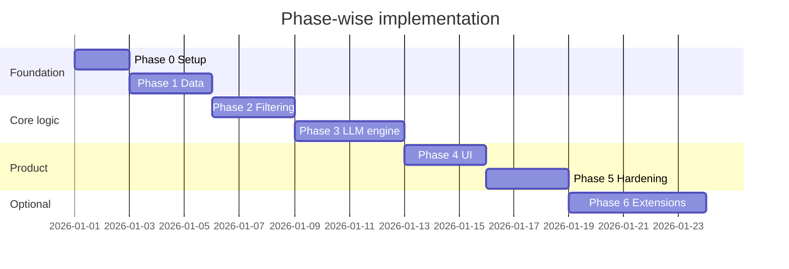
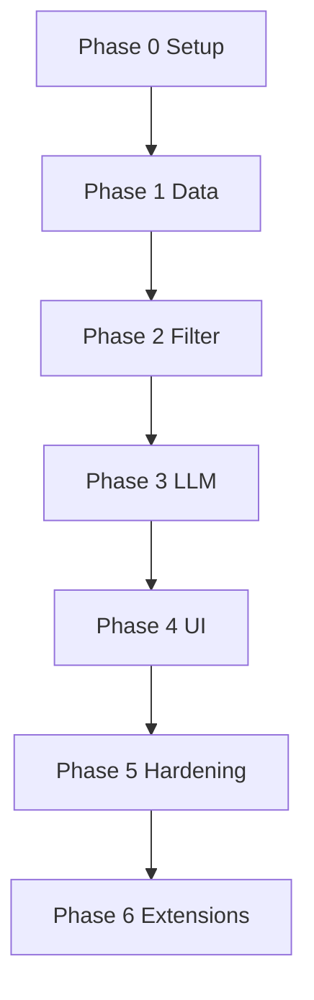

# Implementation Plan: Phase-Wise Delivery

This document defines **when and in what order** to build the AI-powered restaurant recommendation system. Each phase produces a runnable increment with clear exit criteria before moving on.

**Source documents**

| Document | Role |
|----------|------|
| [problemStatement.md](./problemStatement.md) | Scope and success criteria |
| [context.md](./context.md) | Workflow and output fields |
| [architecture.md](./architecture.md) | Layers, components, data flow |
| [edge-cases.md](./edge-cases.md) | Edge cases, expected behavior, tests |

**Rule:** Do not start a phase until the previous phase’s exit criteria are met.

---

## Summary timeline



Durations are indicative (days of focused work). Adjust to your schedule.

---

## Phase map: context + architecture

| Phase | context.md | architecture.md layer | Primary modules |
|-------|------------|----------------------|-----------------|
| 0 | — | Repo + config | Project skeleton |
| 1 | [Data Ingestion](./context.md#data-ingestion) | Layer 1 — Data | `src/data/ingest.py`, `src/models/restaurant.py` |
| 2 | [User Input](./context.md#user-input) | Layer 2 — Filtering | `src/models/preferences.py`, `src/filter/engine.py` |
| 3 | [Integration](./context.md#integration-layer) + [Recommendation](./context.md#recommendation-engine) | Layers 3–4 | `src/llm/*`, `src/recommendation/engine.py`, `src/models/recommendation.py` |
| 4 | [Output Display](./context.md#output-display) | Layer 5 — Presentation | `src/app/streamlit_app.py` |
| 5 | Cross-cutting | §8 Security, reliability, testing | `tests/`, logging, README |
| 6 | — | §11 Extension points | API, cache, feedback, etc. |



**Critical path:** 0 → 1 → 2 → 3 → 4 → 5. Phase 6 is optional.

---

## Phase 0 — Project foundation

**Goal:** Runnable repo, dependencies, and configuration — no business logic yet.

**Architecture reference:** [§9 Physical module layout](./architecture.md#9-physical-module-layout), [§12 Technology choices](./architecture.md#12-technology-choices-mvp-defaults)

### Tasks

- [ ] Initialize Python project (`pyproject.toml` or `requirements.txt`, Python 3.11+)
- [ ] Add `.gitignore` (venv, `.env`, `__pycache__`, `data/`)
- [ ] Create `src/` package layout per architecture (empty modules with `__init__.py`)
- [ ] Add `.env.example` for `GROQ_API_KEY`, `GROQ_MODEL`, and `MOCK_LLM`
- [ ] Document local setup in root `README.md` (install, env, run commands)
- [ ] Pin core deps: `datasets`, `pandas`, `python-dotenv`, `groq`, `streamlit`, `pytest`

### Deliverables

```
src/
├── models/
├── data/
├── filter/
├── llm/
├── recommendation/
└── app/
tests/
data/          # gitignored
.env.example
requirements.txt
```

### Exit criteria

- Fresh clone → venv → `pip install -r requirements.txt` → imports succeed
- Secrets never committed; only `.env.example` in git

---

## Phase 1 — Data ingestion and normalization

**Goal:** Load the Zomato dataset, normalize it, cache locally, and expose `load_catalog()`.

**Maps to:** [context.md — Data Ingestion](./context.md#data-ingestion) · [architecture.md §5.1 Data layer](./architecture.md#51-data-layer)

### Tasks

- [ ] Load [ManikaSaini/zomato-restaurant-recommendation](https://huggingface.co/datasets/ManikaSaini/zomato-restaurant-recommendation) via `datasets`
- [ ] Inspect schema; document column mapping in `src/data/ingest.py`
- [ ] Implement `Restaurant` dataclass: `id`, `name`, `location`, `cuisines`, `rating`, `cost_for_two`, optional `metadata`
- [ ] Normalize: strip strings, parse cuisines, coerce rating and cost to numbers, drop invalid rows
- [ ] Write cache to `data/restaurants.parquet` (or `.csv`)
- [ ] Implement `load_catalog() -> list[Restaurant]` (use cache when present)
- [ ] Log catalog stats: row count, sample cities, rating and cost ranges

### Deliverables

| File | Purpose |
|------|---------|
| `src/models/restaurant.py` | [Restaurant contract](./architecture.md#61-restaurant-internal) |
| `src/data/ingest.py` | Ingest pipeline + `load_catalog()` |

### Exit criteria

- `load_catalog()` returns hundreds+ valid records
- Sample output shows name, location, cuisine, rating, cost for 3 restaurants
- Second run uses cache (faster, no re-download)

### Manual test

```bash
python -m src.data.ingest
```

---

## Phase 2 — Filtering engine (no LLM)

**Goal:** Turn user preferences into a deterministic shortlist — proves data + filters before LLM cost/latency.

**Maps to:** [context.md — User Input](./context.md#user-input) · [architecture.md §5.2 Filtering layer](./architecture.md#52-filtering-layer)

### Tasks

- [ ] Implement `UserPreferences`: `location`, `budget`, `cuisine`, `min_rating`, `extras`
- [ ] Define budget → `cost_for_two` bands (`low` / `medium` / `high`) after exploring dataset distribution
- [ ] Filter rules:
  - Location: case-insensitive match
  - Rating: `rating >= min_rating`
  - Cuisine: token or substring match on `cuisines`
  - Budget: within mapped cost band
  - Extras: keyword filter/boost on name/metadata when available
- [ ] Sort by rating (desc); cap shortlist at **20–50** restaurants
- [ ] Return structured empty result with hints (relax rating, cuisine, or location)
- [ ] Unit tests: `tests/test_filter.py` with 5–10 fixture restaurants

### Deliverables

| File | Purpose |
|------|---------|
| `src/models/preferences.py` | [UserPreferences contract](./architecture.md#62-userpreferences-input) |
| `src/filter/engine.py` | `filter(catalog, prefs) -> list[Restaurant]` |
| `tests/test_filter.py` | Edge cases: empty, single match, budget boundary |

### Exit criteria

- Typical prefs `(Delhi, medium, North Indian, 4.0)` → non-empty shortlist in **&lt; 1 s**
- Impossible prefs → empty list + helpful message
- All filter unit tests pass

### Manual test

```bash
python -c "
from src.data.ingest import load_catalog
from src.filter.engine import filter_restaurants
from src.models.preferences import UserPreferences
# ... construct prefs, print top 10
"
```

---

## Phase 3 — LLM recommendation engine (Groq)

**Goal:** Send shortlist + preferences to **Groq**; return structured ranked recommendations with explanations and fallback.

**Maps to:** [context.md — Integration Layer](./context.md#integration-layer), [Recommendation Engine](./context.md#recommendation-engine) · [architecture.md §5.3–5.4](./architecture.md#53-integration-layer) · [Groq configuration](./architecture.md#53-integration-layer)

### Tasks

- [ ] Implement `Recommendation` model: `restaurant_name`, `cuisine`, `rating`, `estimated_cost`, `explanation`, optional `summary`
- [ ] Implement `LLMClient` interface + **`GroqClient`** in `src/llm/client.py` (not OpenAI)
- [ ] Build prompts in `src/llm/prompts.py` per [prompt design principles](./architecture.md#53-integration-layer):
  - Ground to shortlist only
  - JSON array output
  - Top 5 ranked picks with explanations
- [ ] Implement `RecommendationEngine.recommend(shortlist, prefs)` in `src/recommendation/engine.py`
- [ ] Parse and validate LLM JSON; retry once on malformed response
- [ ] **Fallback:** Top-N from Phase 2 filter + template explanation if LLM fails
- [ ] Cross-check returned `restaurant_name` values against shortlist
- [ ] Cap prompt size (truncate non-essential fields)
- [ ] Mock LLM tests in `tests/test_recommendation.py`; optional live test behind `RUN_LLM_INTEGRATION=1`

### Deliverables

| File | Purpose |
|------|---------|
| `src/models/recommendation.py` | [Recommendation contract](./architecture.md#63-recommendation-output) |
| `src/llm/client.py` | `GroqClient` + `LLMClient` interface |
| `src/llm/prompts.py` | System + user templates |
| `src/recommendation/engine.py` | Orchestration + parser + fallback |
| `tests/test_recommendation.py` | Mocked LLM responses |

### Exit criteria

- End-to-end script: prefs → filter → LLM → 3–5 `Recommendation` objects
- Fallback works with invalid `GROQ_API_KEY` or `MOCK_LLM=1`
- Output fields match [context.md output table](./context.md#output-display)

### Manual test

```bash
export GROQ_API_KEY=...
export GROQ_MODEL=llama-3.3-70b-versatile   # optional
python -m src.recommendation.run \
  --location Bangalore --budget medium --cuisine Italian --min-rating 4.0
```

*(Add `src/recommendation/run.py` CLI stub in this phase if helpful.)*

---

## Phase 4 — Presentation layer (MVP UI + Groq)

**Goal:** User-facing Streamlit app that calls the **Groq**-backed recommendation pipeline end-to-end.

**Maps to:** [context.md — Output Display](./context.md#output-display) · [architecture.md §5.5 Presentation](./architecture.md#55-presentation-layer), [§7.1 MVP deployment](./architecture.md#71-mvp-single-process)

### Tasks

- [ ] Build Streamlit app in `src/app/streamlit_app.py`
- [ ] Form fields: location, budget (select), cuisine, min rating, extras (text or multiselect)
- [ ] Validate input before pipeline (required fields, rating range 0–5)
- [ ] Wire submit → `load_catalog()` → `filter()` → `recommend()` (Groq via `GroqClient`) → display
- [ ] Load `GROQ_API_KEY` / `GROQ_MODEL` from `.env` with `python-dotenv`; document in README
- [ ] Loading spinner during Groq call (typically 1–10 s; fallback if key missing or `MOCK_LLM=1`)
- [ ] Display each result: name, cuisine, rating, estimated cost, explanation
- [ ] Optional one-line summary at top
- [ ] Empty shortlist: friendly message + suggestions (per Phase 2)
- [ ] Errors: user-readable messages, no stack traces in UI
- [ ] Update root `README.md` with run command and screenshot placeholder

### Deliverables

| File | Purpose |
|------|---------|
| `src/app/streamlit_app.py` | MVP UI |
| `README.md` | `streamlit run src/app/streamlit_app.py` |

### Exit criteria

- Non-developer can run locally, submit prefs, see ≥3 recommendations with explanations
- Invalid form input shows inline errors
- Matches [end-to-end sequence](./architecture.md#4-end-to-end-request-flow)

### Manual test

```bash
# .env: GROQ_API_KEY=gsk_...
streamlit run src/app/streamlit_app.py

# Offline demo without Groq
MOCK_LLM=1 streamlit run src/app/streamlit_app.py
```

---

## Phase 5 — Hardening, testing, and documentation

**Goal:** Demo-ready quality: tests green, logging, documented limitations.

**Maps to:** [architecture.md §8 Cross-cutting concerns](./architecture.md#8-cross-cutting-concerns), [§13 Known limitations](./architecture.md#13-known-limitations)

### Tasks

- [ ] Ensure `pytest` passes for filter + recommendation (mocked LLM)
- [ ] Add logging: catalog size, shortlist size, LLM latency, fallback flag — **never** log API keys
- [ ] README: link to `docs/architecture.md`, env vars, dataset attribution, limitations
- [ ] Prompt review: model must not invent restaurants outside shortlist
- [ ] Optional: `Makefile` or `scripts/dev.sh` for `test`, `run`, `ingest`
- [ ] Run smoke test checklist (below)

### Deliverables

- Green `tests/`
- Updated `README.md` and cross-links in `docs/`
- Smoke test checklist (documented)

### Exit criteria

- Full demo path on clean machine using README steps only
- Limitations documented (dataset cities, LLM cost, budget heuristics)

### Smoke test checklist

| # | Step | Expected |
|---|------|----------|
| 1 | Install + set `GROQ_API_KEY` | No install errors |
| 2 | First run loads/caches data | Catalog stats in logs |
| 3 | Submit typical prefs in UI | 3–5 recommendations with explanations |
| 4 | Submit impossible prefs | Friendly empty state |
| 5 | Invalid/missing `GROQ_API_KEY` or `MOCK_LLM=1` | Fallback rankings shown |
| 6 | `pytest` | All tests pass |

---

## Phase 6 — Extensions (optional)

**Goal:** Evolve the product without rewriting core layers.

**Maps to:** [architecture.md §11 Extension points](./architecture.md#11-extension-points)

Pick one or more mini-phases; each should not break Phase 5 smoke tests.

| Extension | Tasks | Depends on |
|-----------|--------|------------|
| **REST API** | FastAPI in `src/api/` wrapping filter + recommend; JSON in/out | Phase 5 |
| **Recommendation cache** | Hash `(prefs + shortlist ids)` → cache LLM JSON; TTL config | Phase 3 |
| **Feedback** | Thumbs up/down in UI; store locally for prompt notes | Phase 4 |
| **Location autocomplete** | Derive city list from catalog; Streamlit selectbox | Phase 1, 4 |
| **Observability** | Structured JSON logs or simple metrics file | Phase 5 |
| **Alternate LLM** | Second `LLMClient` (Groq is default) | Phase 3 |
| **Vector search** | Optional semantic match before filter cap | Phase 1, 2 |

### Exit criteria (per extension)

- Feature documented in README or `docs/`
- Phase 5 smoke tests still pass

---

## Suggested repo structure (end state)

```
testrepo/
├── README.md
├── requirements.txt
├── .env.example
├── .gitignore
├── data/                       # gitignored cache
├── docs/
│   ├── problemStatement.md
│   ├── context.md
│   ├── architecture.md
│   └── implementation-plan.md  # this file
├── src/
│   ├── models/
│   │   ├── restaurant.py       # Phase 1
│   │   ├── preferences.py      # Phase 2
│   │   └── recommendation.py   # Phase 3
│   ├── data/
│   │   └── ingest.py           # Phase 1
│   ├── filter/
│   │   └── engine.py           # Phase 2
│   ├── llm/
│   │   ├── client.py           # Phase 3
│   │   └── prompts.py          # Phase 3
│   ├── recommendation/
│   │   ├── engine.py           # Phase 3
│   │   └── run.py              # Phase 3 (optional CLI)
│   └── app/
│       └── streamlit_app.py    # Phase 4
└── tests/
    ├── test_filter.py          # Phase 2
    └── test_recommendation.py  # Phase 3
```

---

## Definition of done (whole project)

Aligned with [problemStatement.md](./problemStatement.md) and [context.md](./context.md):

- [ ] User can enter location, budget, cuisine, minimum rating, and optional extras
- [ ] System uses the Hugging Face Zomato dataset ([link](./context.md#data-ingestion))
- [ ] Groq LLM ranks restaurants and provides explanations (optional summary)
- [ ] Results show: restaurant name, cuisine, rating, estimated cost, AI explanation
- [ ] Architecture layers remain separable in code ([dependency rule](./architecture.md#9-physical-module-layout))
- [ ] LLM failure degrades gracefully ([fallback path](./architecture.md#54-recommendation-engine))

---

## Latency targets (MVP)

From [architecture.md §4](./architecture.md#4-end-to-end-request-flow):

| Step | Target |
|------|--------|
| Load catalog (cached) | &lt; 500 ms |
| Filter shortlist | &lt; 1 s |
| Groq LLM call | 1–10 s |
| Render UI | &lt; 100 ms |

---

## Document map

```
problemStatement.md     →  why
context.md              →  what (workflow)
architecture.md         →  how (structure)
implementation-plan.md  →  when (phases) — this file
edge-cases.md           →  what can go wrong
```

After Phase 0, update this file if actual `src/` paths differ from the suggestion above.
